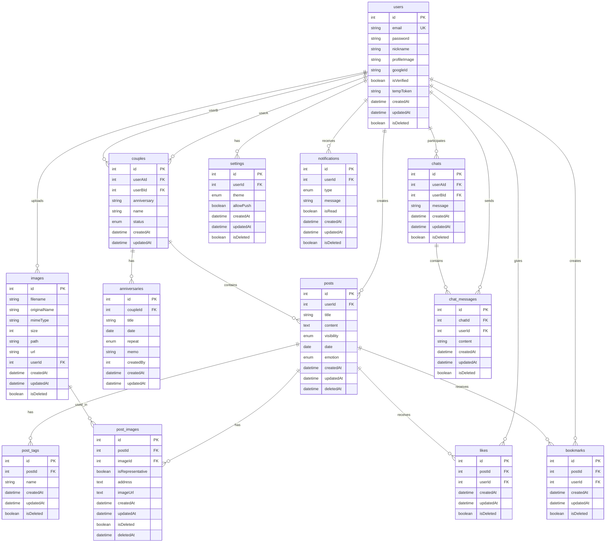

# 데이터베이스 스키마 문서

## 개요
이 문서는 useNaviDate 프로젝트의 데이터베이스 스키마와 엔티티 관계를 설명합니다.

## ERD (Entity Relationship Diagram)

## 엔티티 상세 설명

### 1. users (사용자)
사용자의 기본 정보를 저장하는 테이블입니다.

| 필드 | 타입 | 설명 | 제약조건 |
|------|------|------|----------|
| id | int | 고유 식별자 | Primary Key, Auto Increment |
| email | string | 이메일 주소 | Unique, Not Null |
| password | string | 비밀번호 | Nullable |
| nickname | string | 닉네임 | Nullable |
| profileImage | string | 프로필 이미지 URL | Nullable |
| googleId | string | Google OAuth ID | Nullable |
| isVerified | boolean | 이메일 인증 여부 | Default: false |
| tempToken | string | 임시 토큰 | Nullable |
| createdAt | datetime | 생성일시 | Not Null |
| updatedAt | datetime | 수정일시 | Nullable |
| isDeleted | boolean | 삭제 여부 | Default: false |

### 2. couples (커플)
두 사용자 간의 커플 관계를 정의하는 테이블입니다.

| 필드 | 타입 | 설명 | 제약조건 |
|------|------|------|----------|
| id | int | 고유 식별자 | Primary Key, Auto Increment |
| userAId | int | 첫 번째 사용자 ID | Foreign Key (users.id) |
| userBId | int | 두 번째 사용자 ID | Foreign Key (users.id), Nullable |
| anniversary | string | 기념일 | Not Null |
| name | string | 커플 이름 | Not Null |
| status | enum | 커플 상태 | 'pending', 'confirm', 'delete' |
| createdAt | datetime | 생성일시 | Not Null |
| updatedAt | datetime | 수정일시 | Not Null |

### 3. posts (포스트)
데이트 기록을 저장하는 테이블입니다.

| 필드 | 타입 | 설명 | 제약조건 |
|------|------|------|----------|
| id | int | 고유 식별자 | Primary Key, Auto Increment |
| userId | int | 작성자 ID | Foreign Key (users.id) |
| title | string | 제목 | Not Null |
| content | text | 내용 | Not Null |
| visibility | enum | 공개 여부 | 'private', 'public' |
| date | date | 데이트 날짜 | Not Null |
| emotion | enum | 감정 | 'Joy', 'Fun', 'Soso', 'Sad', 'Mad' |
| createdAt | datetime | 생성일시 | Not Null |
| updatedAt | datetime | 수정일시 | Nullable |
| deletedAt | datetime | 삭제일시 | Nullable |

### 4. anniversaries (기념일)
커플의 기념일을 저장하는 테이블입니다.

| 필드 | 타입 | 설명 | 제약조건 |
|------|------|------|----------|
| id | int | 고유 식별자 | Primary Key, Auto Increment |
| coupleId | int | 커플 ID | Foreign Key (couples.id) |
| title | string | 기념일 제목 | Not Null |
| date | date | 기념일 날짜 | Not Null |
| repeat | enum | 반복 여부 | 'NONE', 'YEARLY' |
| memo | string | 메모 | Nullable |
| createdBy | int | 생성자 ID | Not Null |
| createdAt | datetime | 생성일시 | Not Null |
| updatedAt | datetime | 수정일시 | Not Null |

### 5. images (이미지)
업로드된 이미지 파일 정보를 저장하는 테이블입니다.

| 필드 | 타입 | 설명 | 제약조건 |
|------|------|------|----------|
| id | int | 고유 식별자 | Primary Key, Auto Increment |
| filename | string | 파일명 | Not Null |
| originalName | string | 원본 파일명 | Not Null |
| mimeType | string | MIME 타입 | Not Null |
| size | int | 파일 크기 | Not Null |
| path | string | 파일 경로 | Not Null |
| url | string | 접근 URL | Not Null |
| userId | int | 업로드한 사용자 ID | Foreign Key (users.id), Nullable |
| createdAt | datetime | 생성일시 | Not Null |
| updatedAt | datetime | 수정일시 | Nullable |
| isDeleted | boolean | 삭제 여부 | Default: false |

### 6. post_images (포스트 이미지)
포스트와 이미지의 연결 정보를 저장하는 테이블입니다.

| 필드 | 타입 | 설명 | 제약조건 |
|------|------|------|----------|
| id | int | 고유 식별자 | Primary Key, Auto Increment |
| postId | int | 포스트 ID | Foreign Key (posts.id) |
| imageId | int | 이미지 ID | Foreign Key (images.id) |
| isRepresentative | boolean | 대표 이미지 여부 | Default: false |
| address | text | 이미지 주소 정보 | Nullable |
| imageUrl | text | 이미지 URL | Nullable |
| createdAt | datetime | 생성일시 | Not Null |
| updatedAt | datetime | 수정일시 | Nullable |
| isDeleted | boolean | 삭제 여부 | Default: false |
| deletedAt | datetime | 삭제일시 | Nullable |

### 7. post_tags (포스트 태그)
포스트의 태그 정보를 저장하는 테이블입니다.

| 필드 | 타입 | 설명 | 제약조건 |
|------|------|------|----------|
| id | int | 고유 식별자 | Primary Key, Auto Increment |
| postId | int | 포스트 ID | Foreign Key (posts.id) |
| name | string | 태그명 | Not Null |
| createdAt | datetime | 생성일시 | Not Null |
| updatedAt | datetime | 수정일시 | Nullable |
| isDeleted | boolean | 삭제 여부 | Default: false |

### 8. likes (좋아요)
포스트에 대한 좋아요 정보를 저장하는 테이블입니다.

| 필드 | 타입 | 설명 | 제약조건 |
|------|------|------|----------|
| id | int | 고유 식별자 | Primary Key, Auto Increment |
| postId | int | 포스트 ID | Foreign Key (posts.id) |
| userId | int | 사용자 ID | Foreign Key (users.id) |
| createdAt | datetime | 생성일시 | Not Null |
| updatedAt | datetime | 수정일시 | Nullable |
| isDeleted | boolean | 삭제 여부 | Default: false |

### 9. bookmarks (북마크)
포스트에 대한 북마크 정보를 저장하는 테이블입니다.

| 필드 | 타입 | 설명 | 제약조건 |
|------|------|------|----------|
| id | int | 고유 식별자 | Primary Key, Auto Increment |
| postId | int | 포스트 ID | Foreign Key (posts.id) |
| userId | int | 사용자 ID | Foreign Key (users.id) |
| createdAt | datetime | 생성일시 | Not Null |
| updatedAt | datetime | 수정일시 | Nullable |
| isDeleted | boolean | 삭제 여부 | Default: false |

### 10. chats (채팅)
채팅방 정보를 저장하는 테이블입니다.

| 필드 | 타입 | 설명 | 제약조건 |
|------|------|------|----------|
| id | int | 고유 식별자 | Primary Key, Auto Increment |
| userAId | int | 첫 번째 사용자 ID | Foreign Key (users.id) |
| userBId | int | 두 번째 사용자 ID | Foreign Key (users.id) |
| message | string | 메시지 | Not Null |
| createdAt | datetime | 생성일시 | Not Null |
| updatedAt | datetime | 수정일시 | Nullable |
| isDeleted | boolean | 삭제 여부 | Default: false |

### 11. chat_messages (채팅 메시지)
채팅방의 개별 메시지를 저장하는 테이블입니다.

| 필드 | 타입 | 설명 | 제약조건 |
|------|------|------|----------|
| id | int | 고유 식별자 | Primary Key, Auto Increment |
| chatId | int | 채팅방 ID | Foreign Key (chats.id) |
| userId | int | 발신자 ID | Foreign Key (users.id) |
| content | string | 메시지 내용 | Not Null |
| createdAt | datetime | 생성일시 | Not Null |
| updatedAt | datetime | 수정일시 | Nullable |
| isDeleted | boolean | 삭제 여부 | Default: false |

### 12. settings (설정)
사용자의 개인 설정을 저장하는 테이블입니다.

| 필드 | 타입 | 설명 | 제약조건 |
|------|------|------|----------|
| id | int | 고유 식별자 | Primary Key, Auto Increment |
| userId | int | 사용자 ID | Foreign Key (users.id) |
| theme | enum | 테마 설정 | 'light', 'dark' |
| allowPush | boolean | 푸시 알림 허용 여부 | Not Null |
| createdAt | datetime | 생성일시 | Not Null |
| updatedAt | datetime | 수정일시 | Nullable |
| isDeleted | boolean | 삭제 여부 | Default: false |

### 13. notifications (알림)
사용자에게 전송되는 알림을 저장하는 테이블입니다.

| 필드 | 타입 | 설명 | 제약조건 |
|------|------|------|----------|
| id | int | 고유 식별자 | Primary Key, Auto Increment |
| userId | int | 수신자 ID | Foreign Key (users.id) |
| type | enum | 알림 타입 | 'like', 'event', 'anniversary' |
| message | string | 알림 메시지 | Not Null |
| isRead | boolean | 읽음 여부 | Default: false |
| createdAt | datetime | 생성일시 | Not Null |
| updatedAt | datetime | 수정일시 | Nullable |
| isDeleted | boolean | 삭제 여부 | Default: false |

## 관계 설명

### 1:1 관계
- **users ↔ settings**: 한 사용자는 하나의 설정을 가집니다.

### 1:N 관계
- **users → posts**: 한 사용자가 여러 포스트를 작성할 수 있습니다.
- **users → images**: 한 사용자가 여러 이미지를 업로드할 수 있습니다.
- **users → likes**: 한 사용자가 여러 포스트에 좋아요를 할 수 있습니다.
- **users → bookmarks**: 한 사용자가 여러 포스트를 북마크할 수 있습니다.
- **users → notifications**: 한 사용자가 여러 알림을 받을 수 있습니다.
- **couples → anniversaries**: 한 커플이 여러 기념일을 가질 수 있습니다.
- **posts → post_images**: 한 포스트가 여러 이미지를 가질 수 있습니다.
- **posts → post_tags**: 한 포스트가 여러 태그를 가질 수 있습니다.
- **posts → likes**: 한 포스트가 여러 좋아요를 받을 수 있습니다.
- **posts → bookmarks**: 한 포스트가 여러 북마크를 받을 수 있습니다.
- **chats → chat_messages**: 한 채팅방이 여러 메시지를 가질 수 있습니다.

### N:M 관계
- **users ↔ couples**: 한 사용자가 여러 커플에 속할 수 있고, 한 커플은 두 명의 사용자를 가집니다.
- **users ↔ chats**: 한 사용자가 여러 채팅방에 참여할 수 있습니다.
- **images ↔ posts**: 한 이미지가 여러 포스트에서 사용될 수 있고, 한 포스트가 여러 이미지를 가질 수 있습니다.

## 인덱스 권장사항

### 성능 최적화를 위한 인덱스
1. **users.email**: 이메일 검색 성능 향상
2. **posts.userId**: 사용자별 포스트 조회 성능 향상
3. **posts.date**: 날짜별 포스트 조회 성능 향상
4. **likes.postId**: 포스트별 좋아요 수 조회 성능 향상
5. **bookmarks.userId**: 사용자별 북마크 조회 성능 향상
6. **notifications.userId**: 사용자별 알림 조회 성능 향상
7. **chat_messages.chatId**: 채팅방별 메시지 조회 성능 향상

## 데이터 무결성 제약조건

### 외래키 제약조건
- 모든 외래키는 참조 무결성을 보장합니다.
- 삭제 시 CASCADE 옵션을 사용하여 관련 데이터도 함께 삭제됩니다.

### 유니크 제약조건
- **users.email**: 이메일은 중복될 수 없습니다.
- **likes.postId + userId**: 한 사용자가 같은 포스트에 중복 좋아요를 할 수 없습니다.
- **bookmarks.postId + userId**: 한 사용자가 같은 포스트를 중복 북마크할 수 없습니다.

### 체크 제약조건
- **posts.visibility**: 'private' 또는 'public'만 허용
- **posts.emotion**: 정의된 감정 값만 허용
- **anniversaries.repeat**: 'NONE' 또는 'YEARLY'만 허용
- **settings.theme**: 'light' 또는 'dark'만 허용
- **notifications.type**: 정의된 알림 타입만 허용 